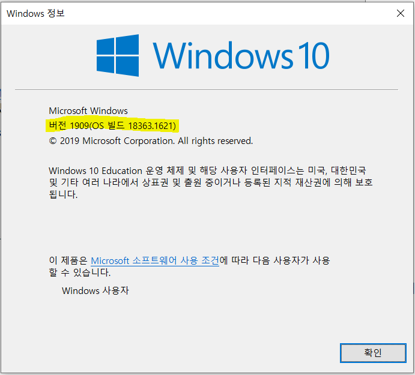
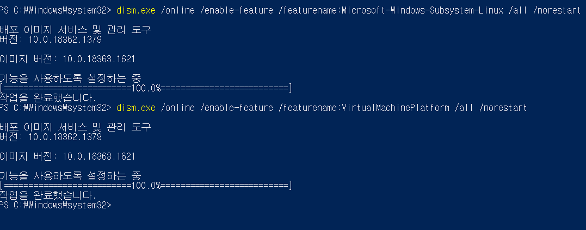
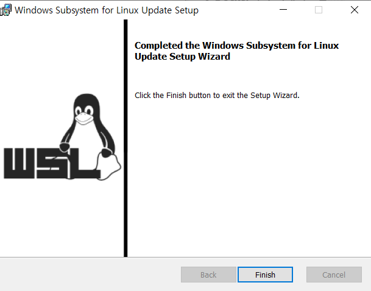
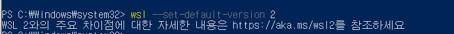
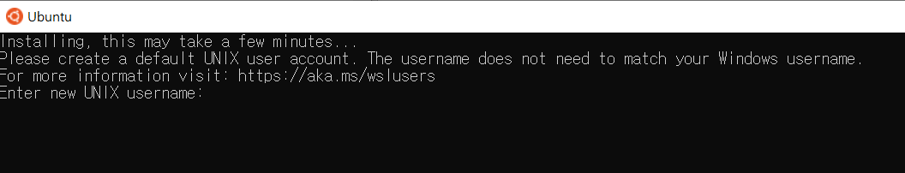
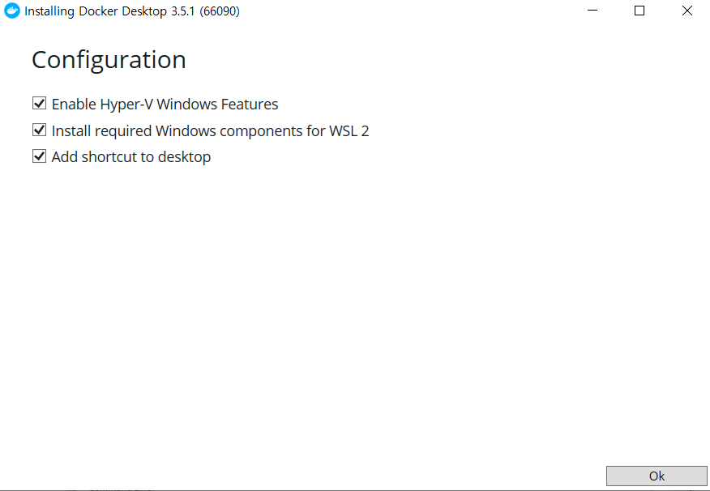

도커, 쿠버네티스 강좌를 듣기 위해서 준비단계로 wsl과 docker desktop을 설치해야한다고 한다. 그래서 오늘은 설치과정을 정리해보았다.

* undemy강좌를 듣고 있음.


---------


##  WSL이란?

- Windows SubSystem for Linux
- 윈도우10에서 리눅스 실행파일(ETF)을 실행하기 위한 호환성 계층.
- 즉, **윈도우에서 리눅스를 사용하기 위한 도구.** 


## WSL2  설치

[해당 문서](https://docs.microsoft.com/ko-kr/windows/wsl/install-win10)를 보고 따라했습니다.


1. **`winver`를 통해 버전을 확인한다. 아래 요구사항이 충족되면 `wsl2`를 실행할 수 있다.**

> WSL 2로 업데이트하려면 Windows 10을 실행해야 합니다.
>
> - <u>x64 시스템의 경우: **버전 1903** 이상, **빌드 18362** 이상</u>
> - ARM64 시스템의 경우: **버전 2004** 이상, **빌드 19041** 이상
> - 18362보다 낮은 빌드는 WSL 2를 지원하지 않습니다. [Windows Update Assistant](https://www.microsoft.com/software-download/windows10)를 사용하여 Windows 버전을 업데이트합니다.





2. **PowerShell을 관리자권한으로 열어서 실행.**

   ```shell
   dism.exe /online /enable-feature /featurename:Microsoft-Windows-Subsystem-Linux /all /norestart
   
   dism.exe /online /enable-feature /featurename:VirtualMachinePlatform /all /norestart
   ```

   



여기까지 한 다음에 **재부팅**을 해야한다.


3. **Linux 커널 업데이트 패키지 다운로드**



4. **WSL2를 기본 버전으로 설정**

   ```
   wsl --set-default-version 2
   ```

   


5. **원하는 Linux골라서 설치.**

   저는 ubuntu로 설치했습니다.

   참고링크 : https://docs.microsoft.com/ko-kr/windows/wsl/user-support

   


**이때 사용자 이름과 암호를 설정해야 합니다.**

이 사용자 이름과 암호는 설치하는 각각의 개별 `Linux`배포에만 적용되며, `windows` 사용자 이름과는 관련이 없습니다. 


**`WSL2`를 쓸 경우 윈도우 파일시스템이 아닌, Linux 파일 시스템에서 프로젝트를 생성하고 실행해야 한다. `Cortana bar`에서 `wsl`로 리눅스 시스템에 접근할 수 있다.**


만약 wsl2를 지원하지 않는 윈도우10이나 윈도우7을 사용 중이라면 `Docker Toolbox`를 다운받아야 한다. 그러나 이 소프트웨어는 공식적으로 deprecated된거라 이후에 계속 사용하기 어려울 수 있다.


### Docker Desktop 설치

- 설치 링크 : https://docs.docker.com/docker-for-windows/wsl/




----


## 참고자료

- http://melonicedlatte.com/2020/07/05/200400.html

