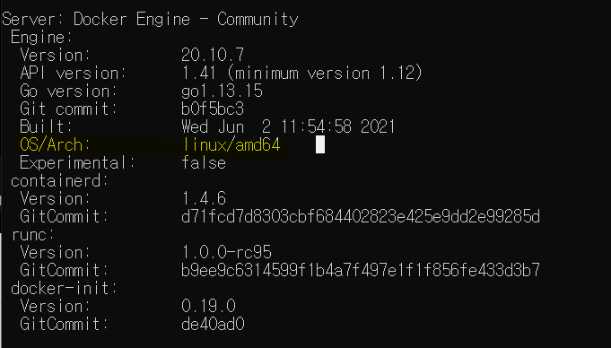
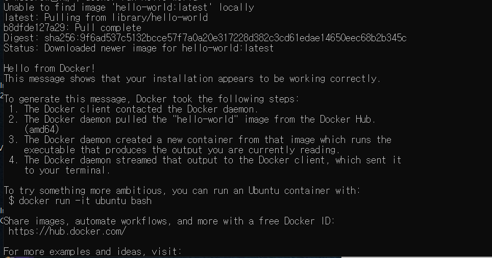
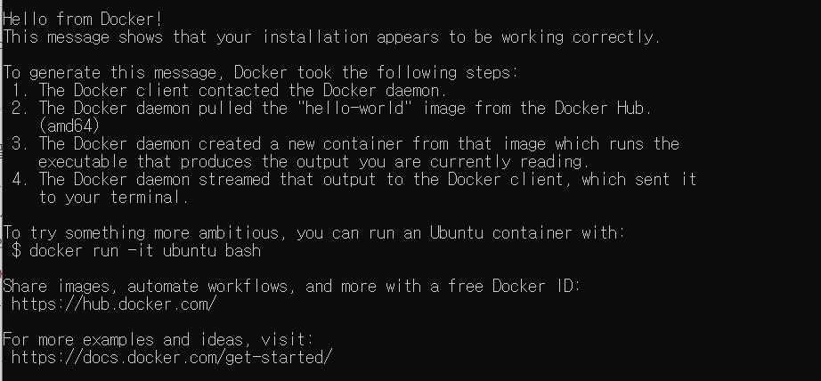
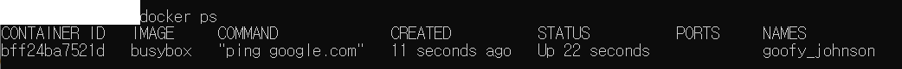
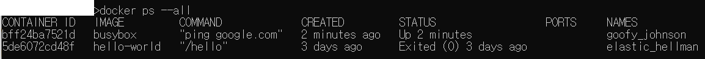

이전 시간엔 [**WSL2와 Docker Desktop for windows, 그리고 linux VM을 설치**](https://github.com/sehui-byte/TIL/blob/main/Docker/WSL2%2BDocker%20Desktop%20%EC%84%A4%EC%B9%98.md)했었다. 이제 설치한 프로그램들을 바탕으로 도커 명령어를 실행시켜보면서 그 동작원리들에 대해 간단히 알아본다.


아래 내용들은 udemey강좌와 그밖에 인터넷에서 참고한 자료들을 바탕으로 정리한 것들이다.

----


### docker version

```shell
docker version
```

os가 **linux**인 것을 확인할 수 있다.




### LXC(Linux Container)

docker는 Host OS, 즉 우리가 맥을 쓰든 윈도우를 쓰든 이와 무관하게 다양한 컨테이너를 올릴 수 있는 기술이다. **도커는 완전히 새로 나온 기술이 아니라, `LXC(linux container)`를 기반으로 한 기술**이다. 즉, **<u>LXC를 만들고 사용할 수 있도록 하는 컨테이너화 기술</u>**이다.


[이전 글](https://github.com/sehui-byte/TIL/blob/main/Docker/0_Docker%EC%99%80%20%EC%BF%A0%EB%B2%84%EB%84%A4%ED%8B%B0%EC%8A%A4%EB%9E%80.md)에 간단히 정리했었는데 이제 여기에서 조금 더 들어가보자.


아래 2가지는 **리눅스 컨테이너 LXC의 특징**이다. 

- **name spacing** : isolating resources per process. 
- **control group (c groups)** : hw 자원을 제어하고 관리하는 영역.


이 두가지를 통해 <u>**리눅스 커널을 격리**</u>시킨다. 이전 가상머신에서는 OS를 가상화하였다면, **도커는 리눅스 커널을 공유하고 name spaces, cgroup 을 통해 이 커널 기능을 격리하여 컨테이너를 독립된 환경에서 실행**시킨다.


그래서 이 격리기술 덕분에 **호스트 OS에겐 컨테이너가 프로세스로 인식되고, 컨테이너 관점에서는 독립적인 환경을 가진 가상머신처럼 보이게 된다.**


------------


### container 실행

`image`를 이용하여 `container`를 실행시킨다.

```
docker run [image name]
```

아래는 `hello-world`컨테이너를 실행시킨 결과이다.

이 `hello-world`는 아래 캡쳐 내용처럼, 간단히 몇줄의 내용을 출력해주는 프로그램이다. 

```shell
docker run hello-world
```



위 캡쳐를 보면 `unable to find image 'hello-word' latest locally`라고 나와있는데 처음에 로컬에서 이미지 파일을 찾는데 해당 이미지가 없으므로 이미지를 내려받게 되기 때문이다.

한번 내려받은 이후로는 캐싱되어 아래 문구만 출력(`hello-world`의 기능)하게 된다.




```shell
docker run busybox echo hi there
```


### container 조회

현재 실행중인 컨테이너를 보여준다. 그러므로 이전에 위에서 실행시켰던 간단한 `hello-world`같은 컨테이너는 바로 실행되서 메세지만 띄워주고 종료되므로, 계속 실행중일 수 있는 컨테이너 `ping.google.com`을 실행시킨 후 다른 cmd를 열어 아래 명령어를 실행시켜보면 결과를 확인할 수 있다.

```shell
docker ps
```



```shell
docker ps --all
```




---------

- udemy강좌 : docker and kubernetes : the complete guide - stephen grider
- [도커-컨테이너 조회,중지,시작,재시작,접속](https://m.blog.naver.com/PostView.naver?isHttpsRedirect=true&blogId=complusblog&logNo=220974632766])

- [docker host에 다양한 linux 배포판(distro) container들이 올라갈 수 있는 이유](https://bluese05.tistory.com/10)

- https://www.redhat.com/ko/topics/containers/what-is-docker

- **https://www.44bits.io/ko/post/is-docker-container-a-virtual-machine-or-a-process**

- **https://www.44bits.io/ko/keyword/linux-container**